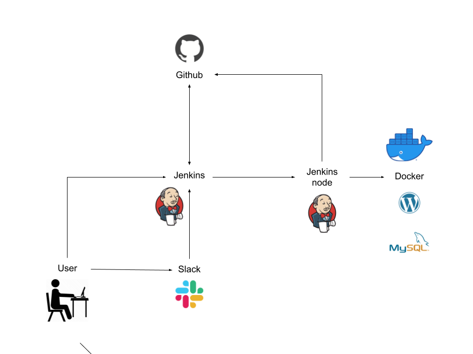

# 17.Project
### Deploy Wordpress
Этот проект позволяет развернуть Wordpress и MySQL.
Управление проектом осуществляется через Jenkins или Slack.
Возможны следующие операции:
1. Deploy
2. Backup
3. Restore (only last backup in Slack)
4. Remove installation
### В проекте использовались
- Github
- Jenkins
- Docker (Wordpress & MySQL image)
- Slack
### Schema
